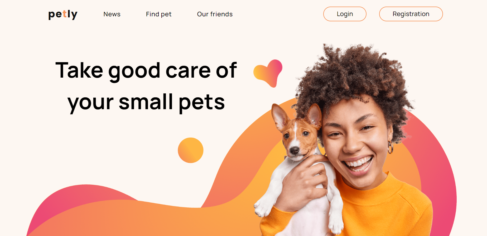

# Team Project "Petly"

Welcome to our team MVP (minimum viable product)

[Our project](https://okarynskyi.github.io/team-project-petly-frontend/)

## BackEnd

BackEnd works on
[https://petly-backend-v11f.onrender.com/](https://petly-backend-v11f.onrender.com/)

BackEnd API docs
[https://petly-backend-v11f.onrender.com/api-docs/](https://petly-backend-v11f.onrender.com/api-docs/)

## Contributors:

[Oleh Okarynskyi](https://github.com/okarynskyi),
[Serhii Lakei](https://github.com/Lakei87),
[Alena Busova](https://github.com/al-busova),
[Alona Tereshchenko](https://github.com/Alena-007),
[Bolgov Vladymyr](https://github.com/VladymyrBolgov),
[RomanUstychenko](https://github.com/RomanUstychenko),
[fullstack2002](https://github.com/fullstack2002),
[VladRosolov](https://github.com/VladRosolov),
[Yana Pavlyk](https://github.com/YanaPav),
[Stanislav Sporevoi](https://github.com/sporevois),
[YuriiKYV](https://github.com/YuriiKYV).
